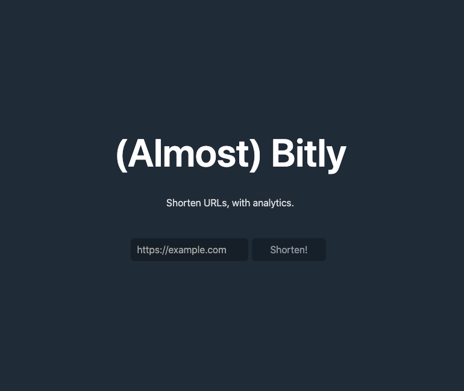

# Almost BitLy

A simplified replication of BitLy. Made with Angular and Appwrite.

## Features

- Shortens links
- Shows statistics for shortened links (number of hits)

## Usage

To use the project on your own server:

- [Set up appwrite](https://appwrite.io/docs/installation)
- Create a new collection with the following schema:
  * url (required): url
  * id (required): string
  * hits (default=0): integer

- Change the environment variables in `src/environments/environment.prod.ts` and `src/environments/environment.prod.ts` to your own URL and keys.
- [Test](#development-server) and [build](#build)

## Development server

Run `ng serve` for a dev server. Navigate to `http://localhost:4200/`. The application will automatically reload if you change any of the source files.

## Build

Run `ng build` to build the project. The build artifacts will be stored in the `dist/` directory.
